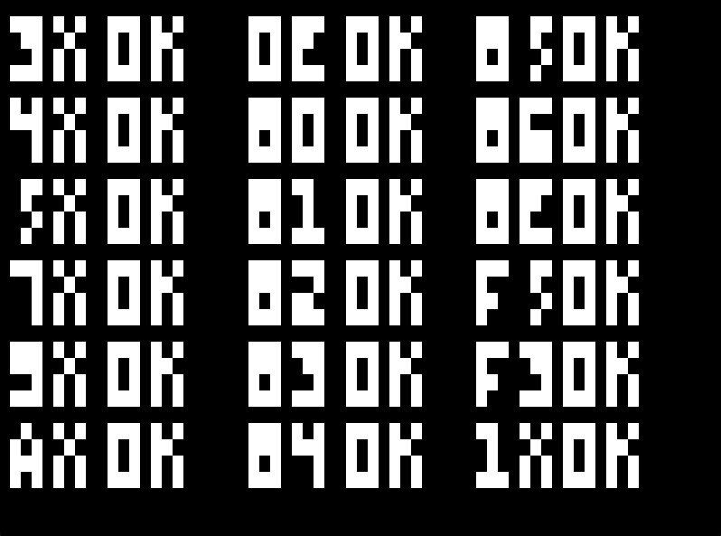
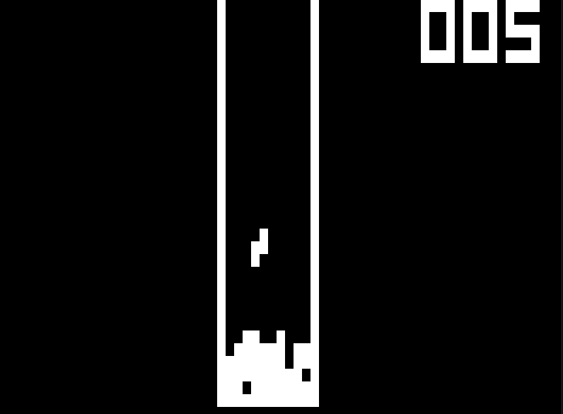

# Chip8 Emulator

Simple Chip8 Emulator written in Rust, using SDL2.

## CLI

Provides an interface using [Clap](https://docs.rs/clap/latest/clap/). See help
below:

```bash
foo@bar:~$ ./chip8 -h
Chip8 emulator

Usage: chip8 [OPTIONS] --rom-path <ROM_PATH>

Options:
  -r, --rom-path <ROM_PATH>        Rom path
  -c, --cycle-delay <CYCLE_DELAY>  Cycle delay in milliseconds [default: 10]
  -h, --help                       Print help information
  -V, --version                    Print version information
```

## Screenshots

Using a test rom:



Playing a tetris rom:


